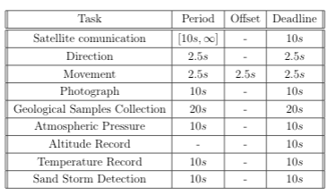
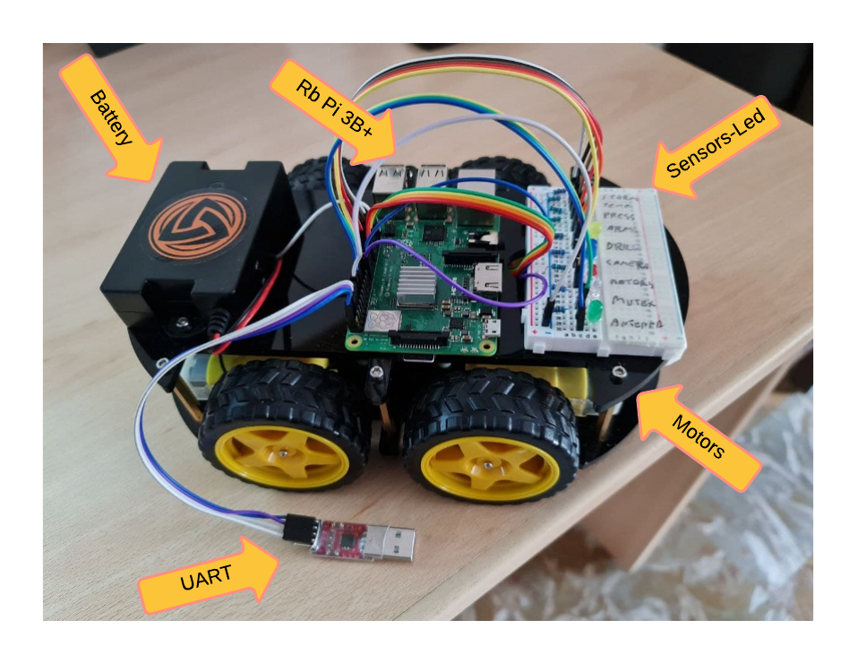
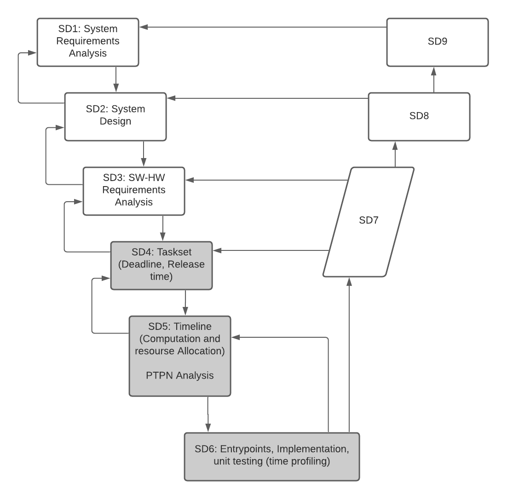
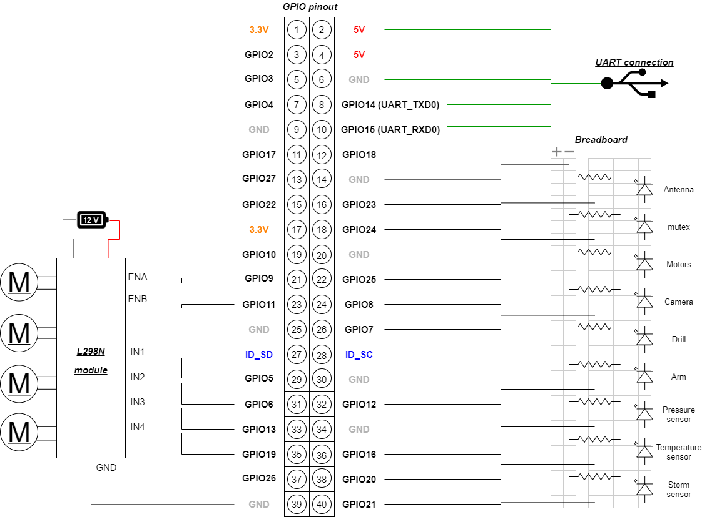

# Resilience Rover
The project for Software Engineering Embedded Systems exam consists of embedded software to develop a <i>"rover-like"</i> platform with Raspberry Pi 3B+ using VxWorks and Oris.
```
├── docs                    # images and documentation
├── workspace-Oris          # design and evaluation of the Taskset
│   ├── README.md
│   └── ...
└── workspace-VxWorks       # implementation of the Taskset           
    ├── hwLib                   # hardware libraries
    ├── utility                 # utility includes
    ├── README.md
    └── ...
```

## Project Workflow
The workflow followed goes from the design of the taskset to its implementation.
<p align=center>
    
</p>

### TaskSet: 
Set of task to implement for Resilience rover:
- Satellite Communication: to permit the rover to communicate with satellite.
- Direction: to compute the direction of reference for rover.
- Movement: to handle motors and mission.
- Photograph: to take photo.
- Geological Sample Collection: handle drill and arm of rover.
- Atmospheric Pressure: to compute pressure and send data to altitude task.
- Altitude Record: to compute and record altitude level.
- Temperature Record: to record temperature.
- Sand Storm Detection: to detection sand storm.
### Timeline: 
Define periods, priorities, chunks and deadlines of taskset.
<p align=center>
    
</p>

### Oris: 
Tool for qualitative verification and quantitative evaluation of reactive timed systems, which supports modeling and analysis of various classes of timed extensions of Petri Nets.

Oris implements symbolic state space analysis of preemptive Time Petri Nets, which enable schedulability analysis of real-time systems running under priority preemptive scheduling; and stochastic Time Petri Nets, which enable an integrated approach to qualitative verification and quantitative evaluation.

### VxWorks: 
VxWorks is a deterministic, priority-based preemptive RTOS with low latency and minimal jitter. It is built on an upgradable, future-proof architecture to help you rapidly respond to changing market requirements and technology advancements.

VxWorks is the only RTOS to support C++17, Boost, Rust, Python, pandas, and more, as well as an edge-optimized, OCI-compliant container engine — enabling you to use the languages, tools, and technologies you love most to innovate where it matters most.

### Target:
Resilience <i>rover-like</i> is the development platform.
<p align=center>
    
</p>

## V-Model
The development followed the following V-model,
<p align=center>
    
</p>

- SD1, SD2, SD3: an initial phase in which we came up with the requirements, i.e., the tasks that the rover would have to perform.
- SD4, SD5, SD6: the steps are,
    - Taskset definition;
    - Timeline drafting;
    - PTPN traduction and analysis;
    - Implementation on VxWorks RTOS;
    - Execution Time profiling.

## Requirements 
```
- Raspberry Pi 3B+
- LAN cable
- 12V battery
- UART cable
- 4 DC motors
- motor shield l298n
- breadboard 
- 9 leds and resistors (~220 ohm)
- SDK VxWorks
```

You can find SDK and development toolchain in that <a href="https://github.com/AngeloDamante/vxWorks-rb3plus-blink-test"> REPO </a>.

### GPIO bus connections
<p align=center>
    
</p>

## Authors
- <a href="https://github.com/AngeloDamante"> Angelo D'Amante </a>
- <a href="https://github.com/KevinMaggi"> Kevin Maggi </a>
