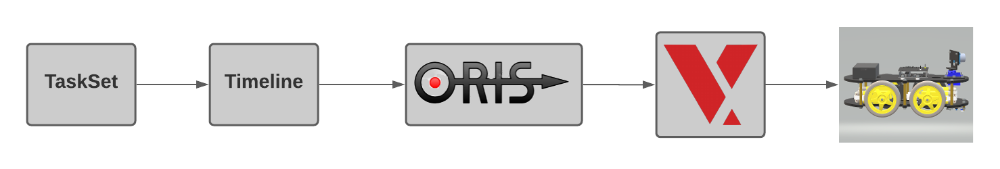
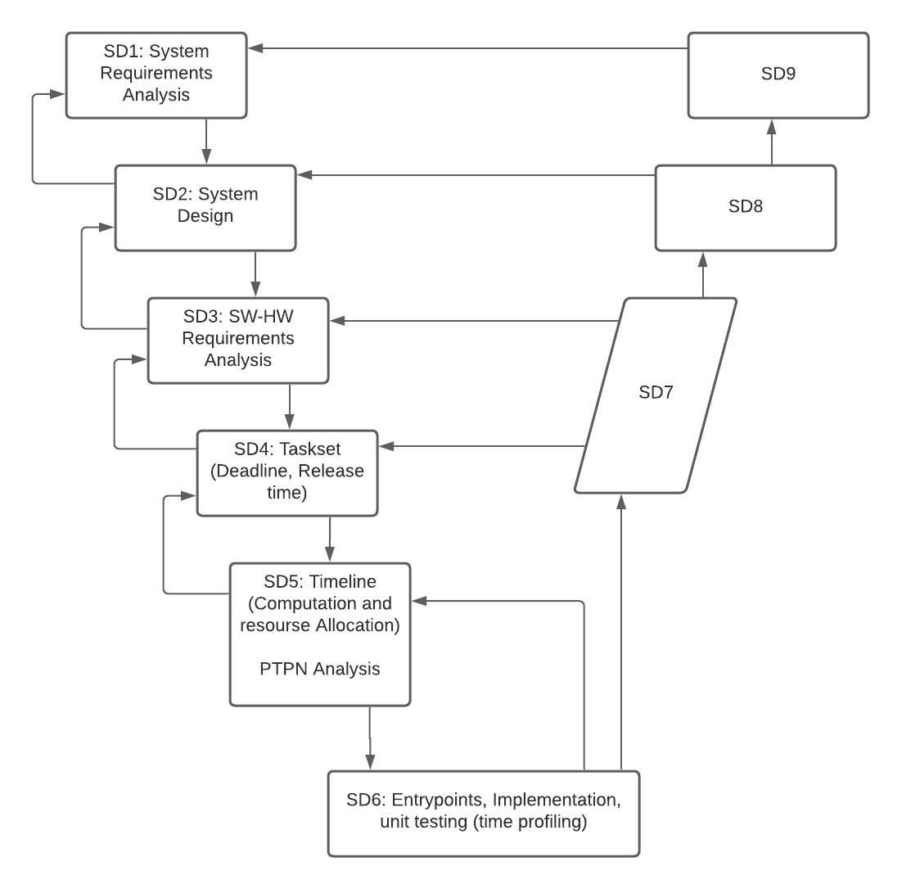

# Idea to develop Anakin-rover
Embedded Software to develop a "like-rover" project with Raspberry Pi 3B+, VxWorks and Oris.

## Workflow
The workflow is as follows, from <b>TaskSet Idea</b> to <b>Hardware Implementation</b> passing through an analysis on <b>ORIS</b> and <b>Develop dkm on VxWorks</b>.

    

The development follows the following V-model,

    

## Authors
- <a href="https://github.com/AngeloDamante"> Angelo D'Amante </a>
- <a href="https://github.com/KevinMaggi"> Kevin Maggi </a>
