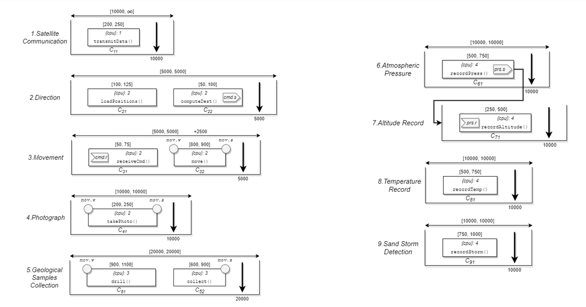
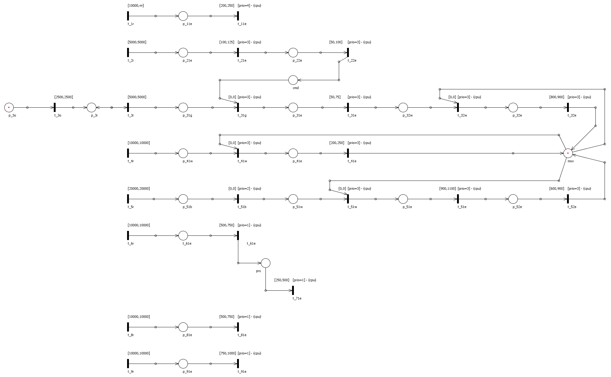

# ORIS workspace
Design and Evaluation Taskset with Preemption Timed Petri Net (PTPN).

## Tree
```
├── traces_analyzer.py
└── Workspace.zip
    ├── Rover
    │   ├── File Importer Box
    │   │   └── ...
    │   ├── Petri Simulator
    │   │   └── ...
    │   ├── PTPN
    │   │   └── ...
    │   ├── TCAnalyzer
    │   │   └── ...
    │   ├── TraceExtractor_1Satellite
    │   │   ├── output_t_1r_t_11e_good.txt
    │   │   └── TraceExtractor_1Satellite.ext
    │   ├── TraceExtractor_2direction
    │   │   ├── output_t_2r_t_22e_good.txt
    │   │   └── TraceExtractor_2direction.ext
    │   ├── TraceExtractor_3movement
    │   │   ├── output_t_3r_t_32e_good.txt
    │   │   └── TraceExtractor_3movement.ext
    │   ├── TraceExtractor_4photograph
    │   │   ├── output_t_4r_t_41e_good.txt
    │   │   └── TraceExtractor_4photograph.ext
    │   ├── TraceExtractor_5samples
    │   │   ├── output_t_5r_t_52e_good.txt
    │   │   └── TraceExtractor_5samples.ext
    │   ├── TraceExtractor_6pressure
    │   │   ├── output_t_6r_t_61e_good.txt
    │   │   └── TraceExtractor_6pressure.ext
    │   ├── TraceExtractor_7altitude
    │   │   ├── output_t_61e_t_71e_good.txt
    │   │   └── TraceExtractor_7altitude.ext
    │   ├── TraceExtractor_8temperature
    │   │   ├── output_t_8r_t_81e_good.txt
    │   │   └── TraceExtractor_8temperature.ext
    │   └── TraceExtractor_9storm
    │       ├── output_t_9r_t_91e_good.txt
    │       └── TraceExtractor_9storm.ext
    ├── Swe4es.oaw
    └── Swe4es.oaw.bkp
```

### Timeline
The first step in translating the taskset to PTPN is to define a valid timeline.
<p align="center">
    
</p>

### PTPN
The resulting PTPN:
<p align="center">
    
</p>

## Feasible Tester
The ```traces_analyzer.py``` script takes care of analyzing the traces to check deadline misses for the given task. 

### Usage
```
python3 traces_analyzer.py file_traces_log_task.txt deadline_task

# example
python3 traces_analyzer.py output_tau_2_t_c21_good.txt 5
```
## Toolchain
1. Make PTPN.
2. TCAnalyzer to make graph with statespace.
3. TraceExtractor for all task -> files with traces.
4. Feasible Tester for each file with traces.
5. Petri Simulator with RTAI_log.txt to verify correct execution.

## Authors
- <a href="https://github.com/AngeloDamante"> Angelo D'Amante </a>
- <a href="https://github.com/KevinMaggi"> Kevin Maggi </a>