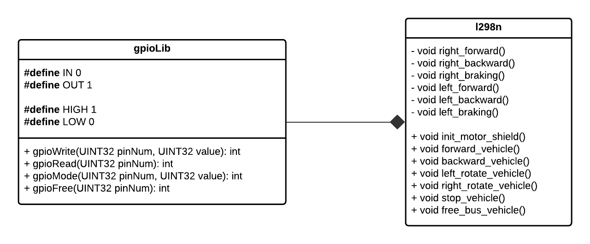
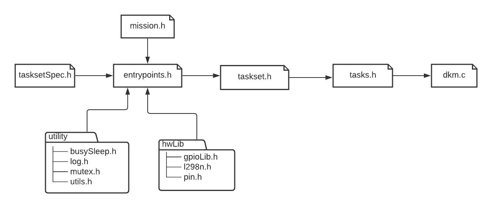
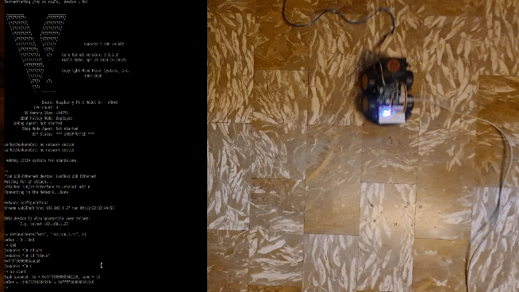

# VxWorks workspace
In this section there are all the functions implemented to develop code for the rover.

## Tree
```
├── hwLib
│   ├── gpioLib.c
│   ├── gpioLib.h
│   ├── l298n.c
│   ├── l298n.h
│   └── pin.h
├──  utility
│   ├── busySleep.c
│   ├── busySleep.h
│   ├── log.c
│   ├── log.h
│   ├── mutex.c
│   ├── mutex.h
│   ├── utils.c
│   └── utils.h
├── LED_time_test.c
├── MOTORS_time_test.c
├── mission.c
├── mission.h
├── mission.txt
├── taskset.c
├── taskset.h
├── tasksetSpec.h
├── tasks.h
├── entrypoints.c
├── entrypoints.h
└── dkm.c
```

### hwLib 
This directory contains the libraries to handle the GPIO bus. The sensors are simulated with LEDs and the motors are controlled with the l298n module.
<p align="center">
    
</p>

### utility
The mutex consists of a structure that takes into account the priorities of the tasks that use it to implement the Priority Ceiling Protocol.
```
struct mutex{
    SEM_ID sem;
    int ceiling;
};

/* PCP */
struct mutex* mov = newMutex();
foreach(task with mov){
    updateCeiling(mov, task.priority);
}
```
The busySleep function is the function to simulate compute timings.
```
void busySleep(int ms);
```

### Main Toolchain
<p align="center">
    
</p>
with:

- ```taskSetSpec.h```: To define taskset specifications.
- ```mission.h```: To define the mission directives.
- ```entrypoints.h```: To define the chunks.
- ```taskset.h```: To define the jobs.
- ```tasks.h```: To define the generator tasks.
- ```dkm.c```: Downloadable Kernel Module with start and stop functions.


## Build and Run
```
git clone https://github.com/AngeloDamante/rover-Raspberry-VxWorks.git
cd rover-Raspberry-VxWorks/workspace-VxWorks
chmod +x build.sh
./build.sh
```

## Target Session
After the loading "dkm.o".
```
sp start                    // active motors, led and spawn periodic tasks

sp spawnSatelliteTask       // sporadic task

sp stop                     // clear GPIO bus and delete all tasks
```

### Resilience in Action!
<p align="center">
    
</p>